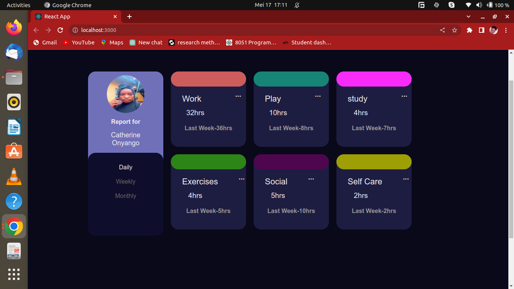

## CSS FLEXBOX
What's this? Flexbox is a css box model to easily layout, align and distribute space among items withing a container either horizontally or vertically.

What Flexbox can do for us?

Simplify layouts
Reduce need for media queries(responsive design)

### Before get started we need to know some of the flexbox basics:
In flexbox, the element or container which wraps all the children elements or items is called flexbox container and childrens or each children elements/items are called flexbox items.

Flex container has their own properties and values

Same goes to children, also flex items/childrens has their own properties and values

In flexbox, there are two axis, they are Main axis and Cross axis.

To make a flex container display: flex;

By default, flex-direction is row. We can change the flex-direction to

#### flex-direction: row || row-reverse || column || column-reverse

